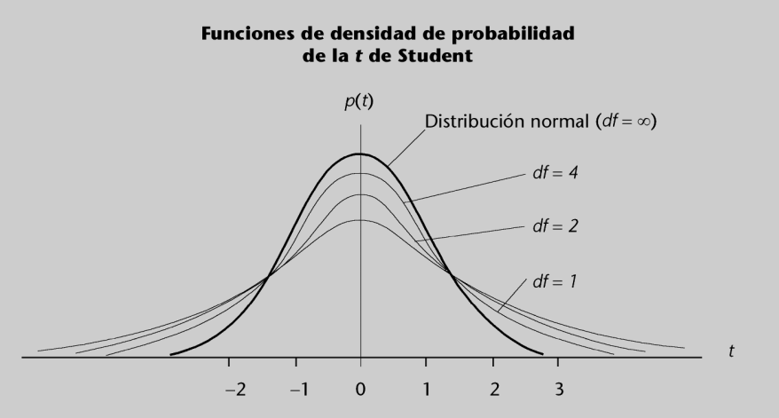

```{r setup, include=FALSE}
knitr::opts_chunk$set(echo = TRUE)
```

\newpage

\section{La distribución de la media muestral}

Supongamos que queremos estudiar la media de la altura de unos estudiantes. De entre ellos hemos seleccionado una muestra al azar, los hemos medido y hemos calculado la media de las alturas de los estudiantes de la muestra. Ahora queremos ver cómo se comporta esta media muestral.

Veremos que si sabemos que la variable que se estudia es normal, entonces la media muestral también es normal, pero con desviación típica menor. También veremos que si la variable no es normal, pero la muestra es lo bastante grande, la media también será aproximadamente normal.

\subsection{Distribución de la media muestral para variables normales}

Supongamos que tenemos una muestra $x_1, ..., x_n$ de una variable aleatoria normal. La media se define como:

\[ \overline{x} = \frac{1}{n} \sum_{i = 1}^n x_i \]

Esta media depende de la muestra. Normalmente tendremos solo una muestra, pero podríamos tomar muchas diferentes, de manera que a cada una le correspondería una media diferente. Esto nos da pie a hablar de la distribución muestral de la media. Para indicar que se trata de una variable aleatoria, la denotaremos por $\overline{X}$.

Deberemos distinguir dos casos: cuando la deviación típica de la variable que medimos es conocida y cuando es desconocida.

\subsubsection{Caso de desviación típica poblacional conocida}

La desviación poblacional es la desviación real de la variable, que en este caso suponemos conocida. Cuando calculamos la desviación a partir de muestras, hablamos de *desviación muestral*.

Supongamos que en un estudio anterior se había demostrado que las alturas de los estudiantes seguían una distribución normal de media $172 \; cm$ y desviación típica de $11 \; cm$.

Intuitivamente vemos que la media de las observaciones de la muestra que tenemos debe ser un valor cercano a $172$. También parece razonable pensar que observaciones mayores que la media poblacional, $172$, se compensarán con valores menores, y que cuanto mayor sea la muestra, más cercano será el valor de la media muestral a $172$.

Pensemos ahora que tenemos una muestra de cien estudiantes. Hacemos diez grupos de diez estudiantes y hacemos la media aritmética para cada grupo. Obtenemos diez valores, correspondientes a las diez medias $\overline{x}_1, ..., \overline{x}_{10}$. Parece razonable pensar que la media de estos nuevos datos sería también $172$. Por otra parte, también parece razonable pensar que estos nuevos valores sean más cercanos a $172$ que los datos originales, ya que en cada una de las medias se nos habrán compensado valores grandes con valores pequeños.

\begin{shaded}
  Si la variable que estudiamos sigue una distribución normal con media $\mu$ y desviación típica $\sigma$ conocidas, entonces la media muestral es también normal con la misma media $\mu$ y desviación típica $\displaystyle \frac{\sigma}{\sqrt{n}}$, donde $n$ es el tamaño de la muestra. Por tanto, tipificamos la variable $\overline{X}$ y obtenemos que:
  
  \[ \frac{\overline{X} - \mu}{\frac{\sigma}{\sqrt{n}}} \]
  
  sigue una distribución normal estándar.
\end{shaded}

La demostración de este resultado es consecuencia de una importante propiedad de las variables aleatorias normales. La propiedad es la siguiente: si $X$ e $Y$ son variables aleatorias independientes con leyes

\[ N(\mu_1, \sigma_1^2) \; \text{y} \; N(\mu_2, \sigma_2^2) \]

respectivamente, entonces $X + Y$ tiene una ley:

\[ N(\mu_1 + \mu_2, \sigma_1^2 + \sigma_2^2) \]

En el ejemplo, la variable que recoge todas las posibles medias de cada grupo de diez estudiantes sigue una distribución normal de media $172 \; cm$ y desviación típica $\displaystyle \frac{11}{\sqrt{10}} = 3.48 \; cm$. Observamos que cuanto mayor es la muestra, menor resulta la desviación típica y, por tanto, hay menor dispersión.

Este cociente que nos da la desviación típica de la media muestral se conoce como *error estándar*.

\begin{shaded}
  Si $\sigma$ es la desviación típica de la población y $n$ el tamaño de la muestra, se define el \textbf{error estándar de la media muestral} como:
  
  \[ \frac{\sigma}{\sqrt{n}} \]
\end{shaded}

**Ejemplo de error estándar de una media muestral**

Consideremos las alturas de los estudiantes. Supongamos que sabemos que se trata de una variable aleatoria normal de media $172 \; cm$ y desviación típica $11 \; cm$ y que hemos tomado una muestra de trescientos estudiantes al azar. Entonces podemos contestar preguntas del tipo siguiente:

a) ¿Cuál es la probabilidad de que la media sea menor que $170 \; cm$?

    La distribución de la media muestral es normal de media $172 \; cm$ y desviación típica:
    
    \[ \frac{11}{\sqrt{300}} = 0.635 \]
    
    Tipificamos la variable para obtener una normal $(0,1)$. Debemos calcular:
    
    \[ P(\overline{X} < 170) = P \left( \frac{\overline{X} - 172}{0.635} < \frac{-2}{0.635} \right) = P(Z < -3.149) = 0.0008 \]
    
    ya que $Z$ es una variable aleatoria normal $(0,1)$.

b) ¿Cuál es la probabilidad de que la distancia entre la media muestral (de esta muestra de trescientos estudiantes) y la media poblacional, $172 \; cm$ sea menor que $1 \; cm$?

    Por un razonamiento parecido (si la distancia entre dos números $a$ y $b$ ha de ser menor que $k$, se debe cumplir $|a - b| < k$):
    
    \[ P(|\overline{X} - \mu| < 1) = P(-1 < \overline{X} - \mu < 1) = P \left( -\frac{1}{0.635} < \frac{\overline{X} - \mu}{0.635} < \frac{1}{0.635} \right) = P(-1.57 < Z < 1.57) \]
    
    donde $Z$ es una variable aleatoria normal $(0, 1)$. Si buscamos en las tablas de la ley normal $(0, 1)$, vemos que esta probabilidad es igual a $0.8836$.
    
    Tenemos así una probabilidad del $0.8836$ de obtener un valor para la media muestral que difiera en menos de $1 \; cm$ del valor real de la media cuando tomamos una muestra de trescientos individuos.
    
    Hay que observar que en ninguna parte hemos utilizado el hecho de que la media fuese exactamente $172 \; cm$. Es decir, si sabemos que la variable "altura" sigue una normal con una desviación típica de $11 \; cm$ y tomamos una muestra de $300$ estudiantes, sabemos que la diferencia entre su media y la media poblacional $\mu$ (que quizás no conozcamos) será menor de $1 \; cm$ con una probabiliad del $0.8836$.

c) Consideremos ahora el problema inverso. Supongamos que desconocemos la media $\mu$ de la altura de los trescientos estudiantes y queremos estudiar una muestra de manera que la diferencia entre la media de la muestra y la de la población $\mu$ sea menor que $1 \; cm$ con una probabilidad del $0.95$. ¿De qué medida tiene que ser nuestra muestra?

    Sabemos que la variable estadística tipificada:
    
    \[ \frac{\overline{X} - \mu}{\frac{11}{\sqrt{n}}} \]
    
    se distribuye como una normal $(0, 1)$. Por otra parte, si observamos las tablas, nos damos cuenta de que si $Z$ es una normal $(0, 1)$:
    
    \[ P(-1.96 < Z < 1.96) = 0.95 \]
    
    Por tanto:
    
    \[ 0.95 = P \left( -1.96 < \frac{\overline{X} - \mu}{\frac{11}{\sqrt{n}}} < 1.96 \right) = P \left( -1.96 \frac{11}{\sqrt{n}} < \overline{X} - \mu < 1.96 \frac{11}{\sqrt{n}} \right) \]
    
    Y si imponemos que la diferencia $\overline{X} - \mu$ debe ser menor que $1 \; cm$, obtenemos:
    
    \[ 1.96 \frac{11}{\sqrt{n}} < 1 \]
    
    Por tanto, $\sqrt{n} > 11 \cdot 1.96$, y así: $n > (11 \cdot 1.96)^2 = 464.8$. Entonces, si tomamos $465$ individuos para llevar a cabo el estudio, sabemos que la diferencia entre la media muestral que obtendremos y la media real será menor de $1 \; cm$, con una probabilidad del $0.95$. Cuanto mayor sea el tamaño de la muestra, menor será la diferencia entre la media muestral y la poblacional.

Si se multiplican el numerador y el denominador por $n$, podemos escribir el resultado que hemos visto en este apartado de otra manera.

\begin{shaded}
  Si la variable que estudiamos sigue una distribución normal con media $\mu$ y desviación típica $\sigma$, entonces:
  
  \[ \frac{\displaystyle \sum_{i = 1}^n X_i - n \mu}{\sqrt{n} \sigma} \]
  
  sigue una distribución normal estándar.
\end{shaded}

\subsection{Caso de desviación típica poblacional desconocida. La \textit{t} de Student}

En los ejemplos estudiados anteriormente necesitábamos dos cosas:

+ Que la variable que se estudiaba fuese normal.
+ Que el valor de la desviación típica de la variable fuese conocido.

Estos dos hechos se conocen gracias a estudios previos. A menudo este estudio no se lleva a cabo, pero podemos suponer que la variable es normal. En este caso deberemos hacer una estimación de la desviación típica con la llamada **desviación típica muestral**:

\[ s = \sqrt{\frac{1}{n - 1} \sum_{i = 1}^n (x_i - \overline{x})^2} \]

Hay que observar que en el caso de la desviación típica muestral se divide por $n - 1$, no por $n$.

De manera que en los cálculos del apartado anterior reemplazaremos la $\sigma$ por la $s$. Entonces la distribución muestral de la media ya no es una distribución normal, como sucedía cuando en lugar de $s$ conocíamos el auténtico valor $\sigma$ de la desviación.

Varios estudios realizados por W. S. Gosset, al final del siglo XIX, demostraron que en este caso se obtiene una distribución diferente a la normal, aunque para tamaños lo bastante grandes se parecen bastante. Esta nueva distribución se conoce con el nombre de *t de Student* con $n - 1$ grados de libertad. Esto significa que por cada medida de la muestra, $n$, en realidad tenemos una distribución diferente.

\begin{shaded}
  La \textbf{distribución \textit{t de Student} con $n$ grados de libertad}, que denotaremos por $t_n$ es muy parecida a la distribución normal $(0, 1)$: es simétrica alrededor del cero, pero su desviación típica es un poco mayor que la de la normal $(0, 1)$, es decir, los valores que toma esta variable están un poco más dispersos. No obstante, cuanto mayor es el número de grados de libertad, $n$, más se aproxima la distribución $t_n$ de Student a la distribución normal $(0, 1)$. Consideraremos que podemos aproximar la $t_n$ por una normal estándar para $n > 100$.
\end{shaded}

Observamos que cuando conocemos el valor auténtico de $\sigma$, la variable $\overline{X}$ sigue siempre una distribución normal, pero su varianza depende de $n$.

El gráfico siguiente representa las funciones de densidad de la *t* de Student para diferentes valores de $n$ y con una línea más gruesa, la densidad de una distribución normal $(0, 1)$.



Si $\sigma$ es desconocida y $n$ es el tamaño de la muestra, calcularemos el error estándar mediante el cociente:

\[ \text{Error estándar} = \frac{s}{\sqrt{n}} \]

Este error estándar nos permite obtener un resultado nuevo importante.

\begin{shaded}
  Si la variable que estudiamos sigue una distribución normal con media $\mu$ y desviación típica desconocida, entonces:
  
  \[ \frac{\overline{X}- \mu}{\frac{s}{\sqrt{n}}} \]
  
  sigue una distribución $t_{n - 1}$, es decir, una $t$ de Student con $n - 1$ grados de libertad.
\end{shaded}

Obviamente, la manera más fácil de calcular probabilidaddes relacionadas con una $t$ de Student es con cualquier *software* estadístico o, incluso, una hoja de cálculo. De todos modos, como en el caso de la normal, comentaremos cómo podemos utilizar unas tablas estadísticas.

Las tablas que nos dan la distribución de la $t$ de Student son parecidas a las de la distribución normal estándar. No obstante, y dado que para cada valor de los grados de libertad tenemos una distribución diferente, las tablas habituales solo nos sirven para ocho probabilidades determinadas (para otros valores hay que utilizar algún *software* apropiado). La forma de utilizar las tablas es la siguiente: buscamos en la primera columna el número de grados de libertad, nos situamos en aquella fila y determinamos qué puntos nos dejan la probabilidad acumulada que nos interesa.

**Ejemplo de utilización de las tablas de la $t$ de Student**

Una empresa indica en un paquete de arroz que el peso medio del paquete es de $900$ gramos. En una inspección hemos analizado el peso en gramos de $10$ paquetes de arroz y hemos obtenido los datos siguientes:

\begin{center}
  \begin{tabular}{ccccc}
    \qquad $890$ \qquad & \qquad $901$ \qquad & \qquad $893$ \qquad & \qquad $893$ \qquad & \qquad $896$ \qquad \\
    \qquad $895$ \qquad & \qquad $894$ \qquad & \qquad $895$ \qquad & \qquad $904$ \qquad & \qquad $899$ \qquad
  \end{tabular}
\end{center}

a) ¿Cuál es la probabilidad de que la distancia entre la media poblacional y la media muestral sea mayor de $3$ gramos?

    Es razonable pensar que el peso en gramos de un paquete de arroz es una variable aleatoria normal con media del peso que indica el paquete, y con una desviación típica determinada. Es decir, de media los paquetes deberían tener $900$ gramos, pero a causa de los errores de medida de los aparatos que los llenan, algunos contendrán un poco más de $900$ gramos y otros, un poco menos. Supongamos, pues, que la variable de interés (el peso del paquete) es normal, pero no sabemos nada de su desviación típica. Con nuestros datos podemos estimar la desviación típica y obtenemos:
    
    \[ s = 4.19 \]
    
    Podemos utilizar el hecho de que $(\overline{X} - \mu) / (s / \sqrt{n})$ es una observación de una $t$ de Student con $n - 1$ grados de libertad (en nuestro ejemplo, puesto que tenemos diez datos, será una $t$ de Student con nueve grados de libertad). Ahora podemos calcular:
    
    \[ P(|\overline{X} - \mu| > 3) = 1 - P(-3 < \overline{X} - \mu < 3) = 1 - P \displaystyle \left( -\frac{3}{\frac{4.19}{\sqrt{10}}} < \frac{\overline{X} - \mu}{\frac{4.19}{\sqrt{10}}} < \frac{3}{\frac{4.19}{\sqrt{10}}} \right) = 1 - P(-2.26 < t_9 < 2.26) \]
    
    donde ya sabemos que $t_9$ es una t de Student con nueve grados de libertad. Podemos calcular esta probabilidad en las tablas:
    
    \[ P(-2.26 < t_9 < 2.26) = 1 - 2P(t_9 \geq 2.26) = 1 - 2 \cdot 0.025 = 0.95 \]
    
    Entonces:
    
    \[ 1 - P(-2.26 < t_9 < 2.26) = 1 - 0.95 = 0.05 \]
    
    Por tanto, a partir de estos datos, todo parece indicar que la empresa engaña a sus clientes. En efecto, si se toma una muestra de tamaño $10$, la probabilidad de que la diferencia entre la media muestral y la real sea mayor de solo $3$ gramos es de un $5 \; \%$. En cambio, la media de nuestra muestra es de $896$ gramos, 4 gramos menos que la cantidad que indica el paquete.
    
    En este caso los valores que nos han aparecido nos han permitido utilizar las tablas. En otras ocasiones necesitaremos utilizar el ordenador.

\subsection{Ejercicios}

1. El gasto mensual de la familia mexicana Robles sigue una distribución normal de media de $3.000$ pesos y varianza $500$. Supongamos que el gasto de cada mes es independiente del de los otros meses. Si el ingreso anual es de $37.000$ pesos, ¿cuál es la probabilidad de que no gasten más de lo que ganan? ¿Cuánto deberían ganar para tener una seguridad del $99 \; \%$ de que no gastarán más de lo que han ganado?

    a) Llamamos $X_A$ al gasto anual. Puesto que el gasto mensual $X_M$ sigue una ley normal de media $3000$ y desviación típica $\sqrt{500}$ y:
    
        \[ 12 \cdot 3000 = 36000 \text{ y } \sqrt{12 \cdot 500} = 77.4597 \]
    
        sabemos que $\displaystyle \frac{X_A - 36000}{77.4597}$ sigue una distribución normal estándar.
    
        Por tanto, la probabilidad de que la familia Robles gaste menos de $37000$ pesos es:
    
        \[ P(X_A < 37000) = P \left( \frac{X_A - 36000}{77.4597} < \frac{37000 - 36000}{77.4597} \right) = P(Z < 12.9099) \]
    
        donde $Z$ es una distribución normal estándar. Si observamos las tablas de la distribución normal estándar, observamos que la probabilidad de que sea menor que $3$ ya es $1$. Por tanto, la probabilidad es $1$, es decir, podemos asegurar con casi un $100 \; \%$ de certeza que no gastarán más de lo que ganan.
        
    b) Para responder a la segunda pregunta, debemos encontrar una cantidad $G$ tal que:
    
        \[ P(X_A < G) = P \left( \frac{X_A - 36000}{77.4597} < \frac{G - 36000}{77.4597} \right) = 0.99 \]
        
        Si observamos las tablas de la normal, vemos que la cantidad:
        
        \[ \frac{G - 36000}{77.4597} \]
        
        debería ser igual a $2.33$ y, por tanto, si resolvemos la ecuación:
        
        \[ \frac{G - 36000}{77.4597} = 2.33 \]
        
        obtenemos que es preciso que $G = 36180.4811$ para tener una seguridad del $99 \; \%$ de que la familia no gastará más de lo que gana.

2. Hemos hecho una encuesta entre los hombres de una población determinada y, a partir de los resultados, deducimos que el peso de los hombres de esta población sigue una distribución normal de media $72$ kg. Para saber si los datos que hemos obtenido son fiables, pesamos a cuatro de los encuestados y obtenemos una media de $77.57$ kg, con una desviación típica de $3.5$ kg. ¿Tenemos suficientes motivos para pensar que los encuestados han mentido cuando nos han dicho su peso?

